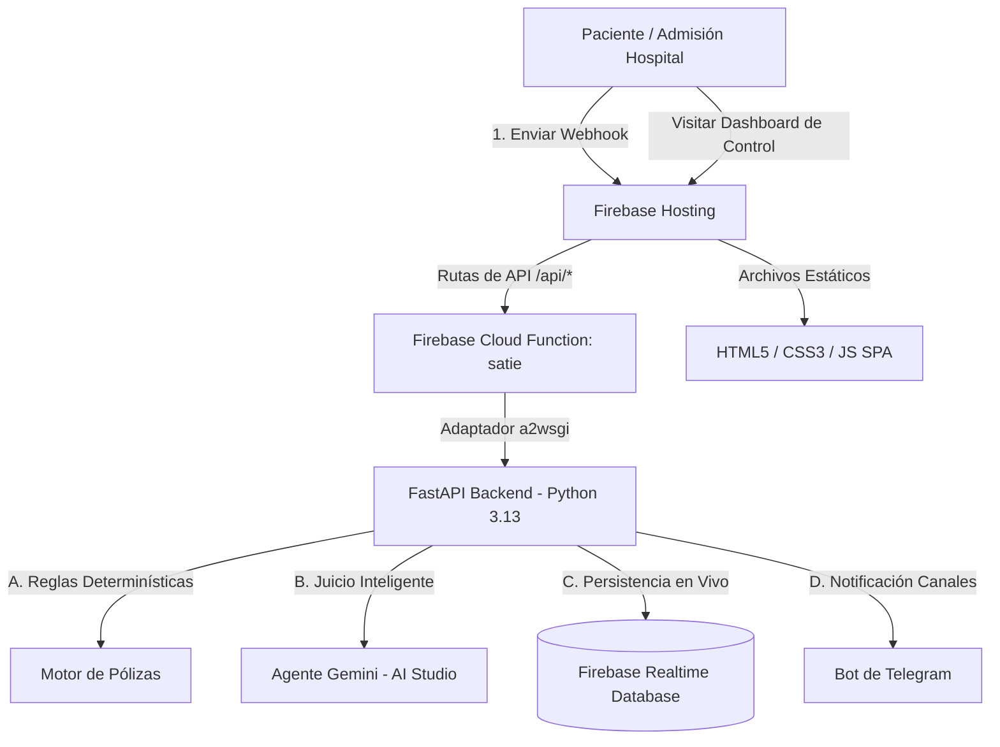

# SATIE — Sistema de Alerta Temprana de Ingresos a Emergencias 🏥🛡️
### Reto — hackIAthon

**SATIE** es una solución integral diseñada para optimizar los ingresos hospitalarios a emergencias en tiempo real. Actúa como el receptor inteligente de los webhooks de admisión del hospital, cruza los datos del paciente con lógica determinística de seguros y emplea un **Agente de Inteligencia Artificial (Gemini)** para realizar un juicio clínico-operativo de preexistencias y periodos de carencia. 

Finalmente, notifica de forma simultánea a admisiones del hospital (con indicaciones operativas claras) y al gestor de casos de la aseguradora (con el análisis detallado de riesgos y tareas recomendadas) mediante alertas personalizadas de Telegram y un panel interactivo premium en tiempo real conectado a Firebase.

---

## 🏗️ Arquitectura del Sistema

La solución está diseñada bajo una arquitectura moderna de origen único (Single-Origin) serverless en **Firebase**:



### Características Principales:
1. **Reglas Determinísticas**: Evaluación en microsegundos de la vigencia de la póliza, estados de mora y periodos de carencia generales/preexistencias antes del análisis de IA.
2. **Agente Gemini (IA)**: Analiza el motivo clínico del ingreso, los signos vitales y los antecedentes del paciente para dictaminar el riesgo del siniestro, la preautorización presunta y sugerir las tareas operativas a seguir.
3. **Resiliencia Operativa**: Si servicios como la base de datos en la nube o las APIs externas están offline, el sistema degrada con elegancia y emplea memoria local para que la experiencia del usuario y del simulador nunca falle.
4. **CORS-Free**: Al utilizar la reescritura de rutas de Firebase Hosting, el frontend y la API comparten origen en producción, anulando los problemas de cabeceras CORS.

---

## 📁 Estructura del Proyecto

*   **`backend/`**: Código fuente de desarrollo de la API original construida sobre **FastAPI**.
*   **`frontend/`**: Arnés de pruebas y simulador interactivo premium (SPA con diseño Glassmorphism, Outfit Font y HSL adaptativo para triaje).
*   **`functions/`**: Código empaquetado para el despliegue serverless de la Cloud Function de Firebase en **Python 3.13** (con el puente `a2wsgi` para servir FastAPI).
*   **`docs/`**: Documentación complementaria y PDFs explicativos del reto.
*   **`firebase.json`** y **`.firebaserc`**: Configuraciones del despliegue en la nube.
*   **`.firebaseignore`** y **`.gitignore`**: Configuraciones inteligentes para excluir dependencias locales (`venv/`, `__pycache__/`) optimizando la carga y seguridad.

---

## 🛠️ Guía de Ejecución Local

### Paso 1: Configurar Variables de Entorno
Copia el archivo `.env.example` en la carpeta `backend/` y renómbralo a `.env`. Completa tus credenciales (puedes utilizar valores ficticios o omitirlos, y el sistema usará inteligentemente su modo *fallback* de simulación):
```env
GEMINI_API_KEY=tu_gemini_api_key
TELEGRAM_BOT_TOKEN=tu_telegram_bot_token
TELEGRAM_CHAT_ADMISIONES=id_chat_hospital
TELEGRAM_CHAT_GESTOR=id_chat_aseguradora
FIREBASE_DB_URL=https://tu-proyecto-rtdb.firebaseio.com
```

### Paso 2: Iniciar el Servidor de API (Backend)
```bash
cd backend
python3 -m venv .venv
source .venv/bin/activate
pip install -r requirements.txt
python3 -m uvicorn main:app --port 8080 --reload
```
*La API local estará disponible en `http://localhost:8080` (Documentación interactiva en `/docs`).*

### Paso 3: Iniciar el Simulador Web (Frontend)
En una nueva terminal:
```bash
cd frontend
python3 -m http.server 3000
```
*Abre `http://localhost:3000` en tu navegador para interactuar con el arnés de pruebas.*

---

## 🚀 Pruebas y Despliegue en Firebase

### Opción A: Simulación Local con Emuladores de Firebase
Firebase te permite emular la nube en tu computadora con un solo comando:

1. Instala el CLI de Firebase si no lo tienes: `npm install -g firebase-tools`
2. Copia tus credenciales locales al directorio de la función: `cp backend/.env functions/.env`
3. Si utilizas Linux (Debian/Ubuntu) y observas problemas para inicializar el entorno virtual, instala el soporte del sistema: `sudo apt install python3-venv`
4. Levanta el simulador completo:
   ```bash
   firebase emulators:start
   ```
   *El frontend emulado estará disponible en `http://localhost:5000` y redirigirá las llamadas de API automáticamente a la Cloud Function emulada.*

### Opción B: Despliegue a Producción (En Vivo)

1. **Iniciar sesión y vincular tu proyecto**:
   ```bash
   firebase login
   firebase use --add
   ```
2. **Otorgar Permisos de Cloud Build en GCP**:
   Ejecuta los siguientes comandos en tu consola para otorgar permisos de compilación a las cuentas de servicio (sustituyendo por tus datos):
   ```bash
   PROJECT_ID="satie-bebf0"
   PROJECT_NUMBER="430859301224"

   gcloud projects add-iam-policy-binding $PROJECT_ID \
     --member="serviceAccount:${PROJECT_NUMBER}-compute@developer.gserviceaccount.com" \
     --role="roles/cloudbuild.builds.builder"

   gcloud projects add-iam-policy-binding $PROJECT_ID \
     --member="serviceAccount:${PROJECT_NUMBER}@cloudbuild.gserviceaccount.com" \
     --role="roles/cloudbuild.builds.builder"
   ```
3. **Desplegar**:
   ```bash
   # Desplegar la función en Cloud Functions Gen 2
   firebase deploy --only functions --project satie-bebf0 --force

   # Desplegar el Hosting del Frontend
   firebase deploy --only hosting --project satie-bebf0
   ```

*Firebase te proporcionará tu URL pública de producción (ej. `https://satie-bebf0.web.app`) lista para su presentación en el hackIAthon.*

---

## 👥 Autores y Creadores

Este proyecto ha sido desarrollado con los más altos estándares de excelencia técnica y de diseño para el **Reto 4 — hackIAthon** por:

*   **Paul Amen** — ✉️ [paul.amen@unesum.edu.ec](mailto:paul.amen@unesum.edu.ec)
*   **Diego Sornoza** — ✉️ [diego.sornoza@unesum.edu.ec](mailto:diego.sornoza@unesum.edu.ec)

---
*Universidad Estatal del Sur de Manabí (UNESUM)* 
